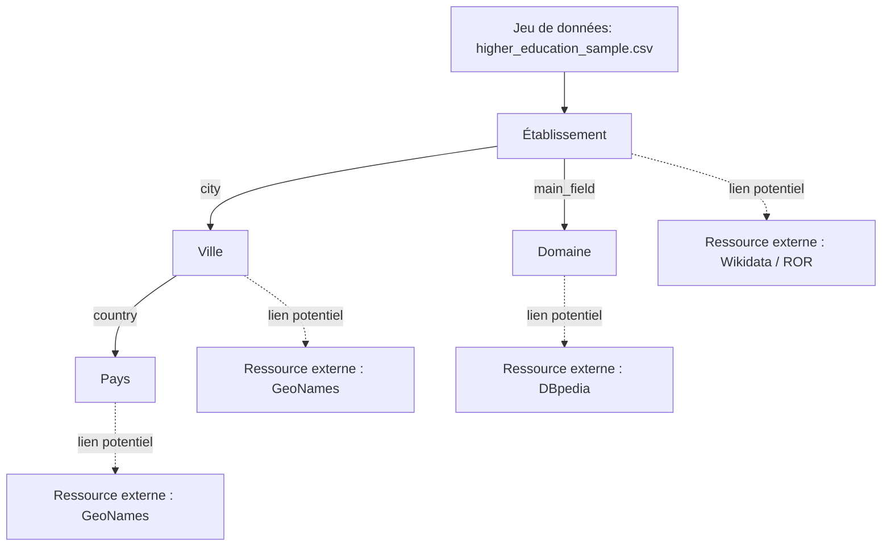

# Carte des entités et des liens potentiels

## 1. Inventaire des entités

| Entité ou type d'entité | Exemple local | Pourquoi s'agit-il d'une entité ? | Attributs associés | Identifiant local potentiel |
| --- | --- | --- | --- | --- |
| Établissement | Ecole Nationale Superieure d'Informatique et d'Analyse des Systemes | C'est un Objet physique et académique du jeu de données ayant des propriétés distinctes. | ``institution_name``, ``short_name``, ``website``, ``institution_type``, ``year_created`` | record_id |
| Ville | Rabat | c'est un lieu géographique qui a ses propres caractèristiques. | ``city`` | Aucun |
| Pays | Morocco | c'est une entité géopolitique englobant les villes listées. | ``country`` | Aucun |
| Domaine | computer science | Concept académique décrivant le champ d'expertise de l'établissement. | ``main_field`` | Aucun |
## 2. Relations conceptuelles observées

| Source | Relation conceptuelle | Cible | Cardinalité | Commentaire |
| --- | --- | --- | --- | --- |
| Établissement | est localisé à | Ville | N:1 | Un établissement se trouve dans une seule ville, Une ville peut contenir plusieurs établissements. |
| Ville | appartient au | Pays | N:1 | Toutes les villes du fichier sont rattachées au Maroc. |
| Établissement | est spécialisé en | Domaine | N:1 | Un établissement est associé à un domaine principal, plusieurs établissements peuvent avoir la même spécialité. |

## 3. Liens externes proposés

| Entité locale | Ressource externe candidate | Type de lien envisagé | Critères d'appariement | Justification | Bénéfice attendu | Niveau de confiance | Risque |
| --- | --- | --- | --- | --- | --- | --- | --- |
| Établissement | Wikidata/ROR | Réconciliation d'identifiants (On relie l'ID local à l'ID global) | ``institution_name``, ``website``, ``city`` | Les universités publiques et grandes écoles sont des entités de recherche majeures, très documentées mondialement. | obtention de métadonnées enrichies. | Élevé | Échec possible de la réconciliation textuelle due à l'absence d'accents dans le jeu de données. |
| Ville | GeoNames | Réconciliation d'identifiants | ``city``, ``country`` | GeoNames est le référentiel géographique standard pour le web sémantique. | Normalisation du nom des villes et obtention instantanée de la latitude et de la longitude. | Très élevé | Faible, les grandes villes marocaines sont parfaitement identifiées dans ces bases. |
| Domaine | DBpedia | Correspondance thématique (exacte ou proche) | ``main_field`` | Permet de relier un texte libre à un vocabulaire académique conceptuel | Standardisation des thématiques | Moyen | Ambiguïté linguistique : le découpage des concepts peut varier (par exemple délimiter "applied sciences" de "science" ). |

## 4. Schéma conceptuel

## 5. Analyse critique

- Quels liens vous paraissent les plus fiables ?

  Les liens géographiques reliant les entités "Ville" à GeoNames et "Pays" à un code standard ISO sont extrêmement fiables car il n'y a pas d'ambiguïté sur des entrées comme "Rabat" au "Morocco".

- Quels liens restent incertains ?

  Le rapprochement direct par le nom des établissements. Les données fournies omettent les accents de la langue française, ce qui peut faire échouer des algorithmes de correspondance stricte avec des bases externes bien formatées.

- Quelles informations supplémentaires faudrait-il pour automatiser les correspondances ?

  L'attribut website  est une bonne clé d'automatisation. Extraire le nom de domaine de l'URL (par exemple, utiliser ensias.um5.ac.ma  plutôt que le nom complet) permet d'interroger très efficacement des API comme le Research Organization Registry.

- Quelles entités devraient recevoir un identifiant stable en priorité ?

  L'Établissement. Actuellement, il ne possède qu'un identifiant local propre à ce fichier (``record_id`` ). Lier cette entité à un identifiant mondial est la priorité pour intégrer ces données dans le web sémantique.

- Quels risques de faux positifs ou de collisions d'identifiants avez-vous identifiés ?

  Le risque principal de collision concerne l'utilisation isolée de l'attribut ``short_name``. Par exemple, requêter une base internationale uniquement avec l'acronyme "EMI" pourrait retourner des résultats non pertinents. Le nom court doit toujours être croisé avec la ville ou le pays.